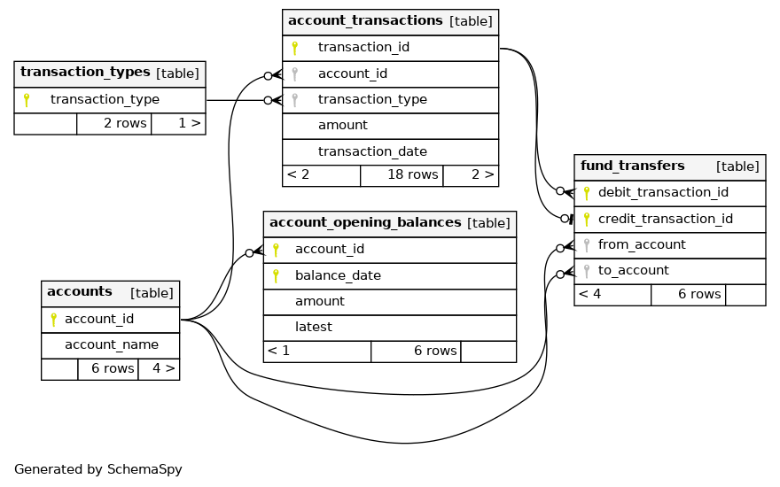

### Greenhouse Bank Service
Banking API

Summary
Create an HTTP API for managing banking accounts. Your API will have six features, each with its own endpoint. Additionally, there are some global requirements.
Deliver a link to a repository containing your project (e.g. GitHub). To get an impression of your way of working we want to be able to see your commit history.

Global requirements

The API and its tests should be written in Clojure.
Automated tests prove each feature/requirement is correctly implemented.
Make use of a database such that domain information (accounts etc.) is not lost on a system restart.
The API is able to asynchronously process 1000 concurrent requests.
Request and response bodies are in JSON format.

Feature 1 - Create a bank account

Requirements

You can create a bank account.
Each bank account has a unique account number.
Account numbers are generated automatically.
New bank accounts start with a balance of 0.

API
Endpoint:

POST /account

Request body:

{
    "name": "Mr. Black"
}

Response body describes the created account:

{
    "account-number": 1,
    "name": "Mr. Black",
    "balance": 0
}

Feature 2 - View a bank account

Requirements

You can retrieve an existing bank account.

API
Endpoint

GET /account/:id

Response body:

{
    "account-number": 1,
    "name": "Mr. Black",
    "balance": 0
}

Feature 3 - Deposit money to an account

Requirements

You can deposit money to an existing bank account.
You can only deposit a positive amount of money.

API
Endpoint

POST /account/:id/deposit

Request body:

{
    "amount": 100
}

The response body describes the new situation:

{
    "account-number": 1,
    "name": "Mr. Black",
    "balance": 100
}

Feature 4 - Withdraw money from an account

Requirements

You can withdraw money from an existing bank account.
You can only withdraw a positive amount of money.
The resulting balance should not fall below zero.

API
Endpoint

POST /account/:id/withdraw

Request body:

{
    "amount": 5
}

The response body describes the new situation:

{
    "account-number": 1,
    "name": "Mr. Black",
    "balance": 95
}

Feature 5 - Transfer money between accounts

Requirements

You can transfer money from one existing account to another existing account.
You cannot transfer money from an account to itself.
The resulting balance of the sending account should not fall below
zero.

API
Endpoint

POST /account/:id/send

Request body:

{
    "amount": 50,
    "account-number": 800
}

Where :id describes the sender and "account-number" the receiver.
The response body describes the new situation of the sending
account:

{
    "account-number": 1,
    "name": "Mr. Black",
    "balance": 45
}

Feature 6 - Retrieve account audit log

Requirements

You can retrieve the audit log of an account.
The audit log consists of records describing the events on the account.
The audit log records appear in reverse chronological
order.
An audit record has the following fields:

sequence: incrementing transaction sequence number

debit: amount of money that was removed

credit: amount of money that was added

description: describes the action that took place. Possible values:

"withdraw"
"deposit"
"send to #900" (a transfer to account 900)
"receive from #800" (a transfer from account 800)

API
Endpoint:

GET /account/:id/audit

Assuming the following sequence of transactions:

deposit $100 to account #1
transfer $5 from account #1 to account #900
transfer $10 from account #800 to account #1
withdraw $20 from account #1

The endpoint responds with this body:

[
    {
        "sequence": 3,
        "debit": 20,
        "description": "withdraw"
    },
    {
        "sequence": 2,
        "credit": 10,
        "description": "receive from #800"
    },
    {
        "sequence": 1,
        "debit": 5,
        "description": "send to #900"
    },
    {
        "sequence": 0,
        "credit": 100,
        "description": "deposit"
    }
]
This service exposes 6 API endpoints:
1. **POST /account** creates a new account.  
2. **GET /account/:id** is used to fetch the account name and balance.  
3. **POST /account/:id/deposit** can be used to deposit money to an account. The body of the request contains the amount to be credited.  
4. **POST /account/:id/withdraw** can be used to debit money from an account. The body of the request contains the amount to be debited.  
5. **POST /account/:id/send** can be used to transfer money from one account to another. The body of the request contains the recipient account and the amount to be transferred.  
6. **GET /account/:id/audit** fetches the transaction history for an account.  

[Refer](https://gitlab.com/greenhousecode/lemonpi/hiring/-/blob/master/assignments/bank.md) for more details.  

### The datamodel

&nbsp;  

### Getting to know the datamodel  
Creation of a new account creates a row in the ***accounts*** table as well as a row in the ***account_opening_balances*** table.  
The ***account_opening_balances*** table holds the balance of an account at a given point in time (the opening date). This table is updated periodically at the start of the month or start of the week (as per requirement) and a new row is inserted reflecting the balance by adding or subtracting the credit or debit transactions that have occured after the previous opening balance date.  
As you may have noticed from the previous paragraph, we do not store a real time updated balance anywhere. The current balance is computed by adding or subtracting the credit or debit transactions that have occured after the latest opening balance was calculated.  
The ***account_transactions*** table holds all the credit or debit transactions that occur in the system.  
A funds transfer consists of two parts - debit from one account and credit to another. The debits and credits are logged in the ***account_transactions*** table while the ***funds_transfer*** table links the two legs of a transfer.   

**NOTE:** The process to update the opening balances periodically is not implemented.  

### Setting up a dev environment
#### Software required
You should have the following installed on your laptop  
1. Postgres  
2. Leiningen  

#### Setting up the database
1. Run the script [createdb.sh](https://github.com/anuj-seth/greenhouse/blob/main/createdb.sh)  
2. The script assumes that Postgres in installed using a user called "postgres" (the default installation method under linux).
3. You should have permissions to `sudo` to the postgres user to run the commands.  
4. The script will create a user in postgres called **greendev**.  
5. A database called **greenhouse** and a schema in that database called **bank** will also be creatd. The **bank** schema will hold all our application tables.  
2. If step 1 was successful you will have an empty database. 
3. The application tables will be created when the migrations are run explicitly from the repl or automatically when the process is started from the jar.  

#### Running a repl
1. You can start a repl in the project by running `lein repl`  
2. Once the repl starts run `(user/go)` to start our webserver  
3. To create application tables by applying our migrations run `(db/migrate-schema)`  
4. If you want to rollback some migrations you can run `(db/rollback-schema)`. This function takes an optional numeric argument as to how many migrations to rollback, the default being 1.  

### Testing the application
#### The elephant in the room or why there are only integration tests
This application is highly reliant on database queries with only two business validations. Implementing unit tests would have required heavy mocking adding dubious value to the quality of our code.  
The integration test suite exercises all the aspects of the API exposed.  

#### Runing integration tests
1. Start the application by running `(user/go)` in the repl or `java -jar target/uberjar/greenhouse-0.1.0-SNAPSHOT-standalone.jar`  
2. Run the tests from the repl `lein test`  

  
